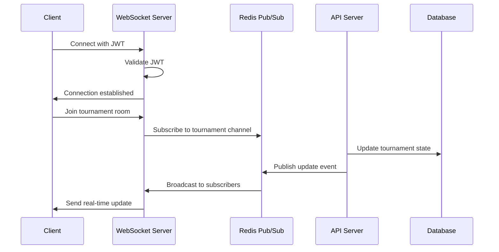

# Technical Architecture - TURNUVAYONETIM

## System Overview

TURNUVAYONETIM is built on a modern, scalable microservices architecture designed for real-time tournament management. The system emphasizes type safety, real-time synchronization, and horizontal scalability.

## Core Architecture Principles

### 1. Type-Safe End-to-End Development
- **TypeScript everywhere**: Frontend, backend, and shared types
- **tRPC**: Type-safe API calls without code generation
- **Prisma**: Type-safe database access with auto-generated types
- **Zod**: Runtime type validation for all inputs

### 2. Real-Time First Design
- **WebSocket backbone**: All time-critical updates via Socket.IO
- **Server-authoritative state**: Prevents client-side manipulation
- **Event sourcing**: Complete audit trail of all state changes
- **Optimistic UI updates**: Instant feedback with rollback capability

### 3. Scalability & Performance
- **Horizontal scaling ready**: Redis pub/sub for multi-server communication
- **Database optimization**: Indexed queries, connection pooling
- **Caching strategy**: Redis for session and frequently accessed data
- **Code splitting**: Lazy loading for optimal bundle sizes

## Technology Stack Details

### Frontend Architecture

```typescript
// Technology choices and rationale
{
  "Next.js 14": {
    reason: "Server-side rendering, optimal SEO, built-in optimizations",
    features: ["App Router", "Server Components", "Streaming SSR"]
  },
  "TypeScript": {
    reason: "Type safety, better IDE support, reduced runtime errors",
    strictMode: true
  },
  "Tailwind CSS": {
    reason: "Utility-first, smaller bundle size, consistent design",
    features: ["JIT compiler", "Custom design system"]
  },
  "Socket.IO Client": {
    reason: "Reliable WebSocket with fallbacks, auto-reconnection",
    transports: ["websocket", "polling"]
  },
  "tRPC Client": {
    reason: "Type-safe API calls, no code generation needed",
    features: ["React Query integration", "Optimistic updates"]
  }
}
```

### Backend Architecture

```typescript
// Service separation and responsibilities
{
  "API Server (Port 4000)": {
    responsibilities: [
      "Authentication & Authorization",
      "CRUD operations",
      "Business logic",
      "Database interactions"
    ],
    stack: ["Express", "tRPC", "Prisma", "JWT"]
  },
  "WebSocket Server (Port 3003)": {
    responsibilities: [
      "Real-time clock synchronization",
      "Live tournament updates",
      "Player status broadcasting",
      "Table changes"
    ],
    stack: ["Socket.IO", "Redis pub/sub", "Clock Engine"]
  }
}
```

### Database Design

```sql
-- Performance-optimized schema design
-- Indexes on frequently queried columns
-- Soft deletes for audit trail
-- JSON columns for flexible data

CREATE INDEX idx_tournament_status ON tournaments(status);
CREATE INDEX idx_player_tournament ON tournament_players(tournament_id, status);
CREATE INDEX idx_event_tournament_time ON tournament_events(tournament_id, timestamp);
```

## Real-Time Synchronization Architecture

### Clock Synchronization Algorithm

```typescript
class ClockSynchronization {
  private serverTime: number;
  private clientOffset: number = 0;
  private samples: number[] = [];

  async synchronize() {
    // Take 5 samples for accuracy
    for (let i = 0; i < 5; i++) {
      const t1 = Date.now();
      const serverTime = await this.fetchServerTime();
      const t2 = Date.now();

      // Calculate round-trip time
      const rtt = t2 - t1;

      // Estimate server time at t2
      const estimatedServerTime = serverTime + (rtt / 2);

      // Calculate offset
      const offset = estimatedServerTime - t2;
      this.samples.push(offset);
    }

    // Use median to eliminate outliers
    this.clientOffset = this.median(this.samples);

    // Accuracy typically <150ms
    return this.clientOffset;
  }

  getServerTime(): number {
    return Date.now() + this.clientOffset;
  }
}
```

### WebSocket Event Flow



## Scaling Strategy

### Horizontal Scaling Architecture

```yaml
# Production deployment for 10,000+ concurrent users

Load Balancer (AWS ALB / Nginx):
  - Sticky sessions for Socket.IO
  - Health checks on /health
  - SSL termination

Application Tier (Auto-scaling 3-10 instances):
  Frontend Servers:
    - Next.js in production mode
    - Static asset caching
    - CDN integration

  API Servers:
    - Stateless design
    - JWT validation
    - Database connection pooling

  WebSocket Servers:
    - Socket.IO with Redis adapter
    - Horizontal pod autoscaling
    - Session affinity

Data Tier:
  PostgreSQL:
    - Primary-replica setup
    - Read replicas for queries
    - Connection pooler (PgBouncer)
    - Automatic failover

  Redis Cluster:
    - Master-slave replication
    - Sentinel for HA
    - Separate cache and pub/sub
```

### Redis Adapter Configuration

```typescript
// Enable multi-server WebSocket communication
import { Server } from 'socket.io';
import { createAdapter } from '@socket.io/redis-adapter';
import { createClient } from 'redis';

const pubClient = createClient({
  url: process.env.REDIS_URL,
  retry_strategy: (options) => {
    if (options.total_retry_time > 1000 * 60 * 60) {
      return new Error('Retry time exhausted');
    }
    return Math.min(options.attempt * 100, 3000);
  }
});

const subClient = pubClient.duplicate();

io.adapter(createAdapter(pubClient, subClient));

// Performance tuning
io.engine.opts.pingTimeout = 60000;
io.engine.opts.pingInterval = 25000;
```

## Security Architecture

### Authentication Flow

```typescript
// JWT-based authentication with refresh tokens

interface TokenPayload {
  userId: string;
  email: string;
  organizationId?: string;
  role: 'ADMIN' | 'DIRECTOR' | 'STAFF' | 'PLAYER';
}

class AuthService {
  generateTokens(user: User) {
    const payload: TokenPayload = {
      userId: user.id,
      email: user.email,
      organizationId: user.organizationId,
      role: user.role
    };

    const accessToken = jwt.sign(payload, process.env.JWT_SECRET, {
      expiresIn: '15m',
      issuer: 'turnuvayonetim'
    });

    const refreshToken = jwt.sign(
      { userId: user.id },
      process.env.REFRESH_SECRET,
      { expiresIn: '7d' }
    );

    // Store refresh token in Redis
    await redis.setex(
      `refresh:${user.id}`,
      7 * 24 * 60 * 60,
      refreshToken
    );

    return { accessToken, refreshToken };
  }
}
```

### Authorization Middleware

```typescript
// Role-based access control (RBAC)

const authorize = (requiredRoles: Role[]) => {
  return async (req: Request, res: Response, next: NextFunction) => {
    const user = req.user;

    if (!user) {
      return res.status(401).json({ error: 'Unauthorized' });
    }

    if (!requiredRoles.includes(user.role)) {
      return res.status(403).json({ error: 'Insufficient permissions' });
    }

    // Check organization-level permissions
    if (req.params.organizationId) {
      const hasAccess = await checkOrganizationAccess(
        user.id,
        req.params.organizationId
      );

      if (!hasAccess) {
        return res.status(403).json({ error: 'Access denied' });
      }
    }

    next();
  };
};

// Usage
router.post('/tournament',
  authorize(['ADMIN', 'DIRECTOR']),
  createTournament
);
```

## Event Sourcing Implementation

### Event Store Pattern

```typescript
// Complete audit trail with event sourcing

interface BaseEvent {
  id: string;
  aggregateId: string;
  type: string;
  data: any;
  metadata: {
    userId?: string;
    timestamp: Date;
    version: number;
  };
}

class EventStore {
  async append(event: BaseEvent): Promise<void> {
    // Store event in database
    await prisma.tournamentEvent.create({
      data: {
        id: event.id,
        tournamentId: event.aggregateId,
        eventType: event.type,
        eventData: event.data,
        userId: event.metadata.userId,
        timestamp: event.metadata.timestamp
      }
    });

    // Publish to event bus
    await redis.publish(`events:${event.aggregateId}`, JSON.stringify(event));

    // Update materialized views
    await this.updateProjections(event);
  }

  async replay(aggregateId: string, toVersion?: number): Promise<State> {
    const events = await prisma.tournamentEvent.findMany({
      where: {
        tournamentId: aggregateId,
        version: toVersion ? { lte: toVersion } : undefined
      },
      orderBy: { version: 'asc' }
    });

    return events.reduce((state, event) => {
      return this.applyEvent(state, event);
    }, initialState);
  }
}
```

### Event Types

```typescript
// Domain events for tournament management

enum TournamentEventType {
  // Tournament lifecycle
  TOURNAMENT_CREATED = 'TOURNAMENT_CREATED',
  TOURNAMENT_STARTED = 'TOURNAMENT_STARTED',
  TOURNAMENT_PAUSED = 'TOURNAMENT_PAUSED',
  TOURNAMENT_RESUMED = 'TOURNAMENT_RESUMED',
  TOURNAMENT_COMPLETED = 'TOURNAMENT_COMPLETED',

  // Player events
  PLAYER_REGISTERED = 'PLAYER_REGISTERED',
  PLAYER_ELIMINATED = 'PLAYER_ELIMINATED',
  PLAYER_REBOUGHT = 'PLAYER_REBOUGHT',
  PLAYER_SEATED = 'PLAYER_SEATED',
  PLAYER_MOVED = 'PLAYER_MOVED',

  // Clock events
  LEVEL_STARTED = 'LEVEL_STARTED',
  LEVEL_COMPLETED = 'LEVEL_COMPLETED',
  BREAK_STARTED = 'BREAK_STARTED',
  BREAK_ENDED = 'BREAK_ENDED',

  // Table events
  TABLE_CREATED = 'TABLE_CREATED',
  TABLE_BALANCED = 'TABLE_BALANCED',
  TABLE_BROKEN = 'TABLE_BROKEN'
}
```

## Performance Optimization

### Database Query Optimization

```typescript
// Optimized queries with proper indexing and eager loading

class TournamentRepository {
  async getTournamentWithPlayers(id: string) {
    return prisma.tournament.findUnique({
      where: { id },
      include: {
        players: {
          where: { status: 'ACTIVE' },
          orderBy: { currentChips: 'desc' },
          include: {
            player: {
              select: {
                id: true,
                firstName: true,
                lastName: true,
                avatarUrl: true
              }
            }
          }
        },
        blindLevels: {
          orderBy: { levelNumber: 'asc' }
        },
        _count: {
          select: {
            players: true,
            events: true
          }
        }
      }
    });
  }
}
```

### Caching Strategy

```typescript
// Multi-layer caching for optimal performance

class CacheService {
  private memoryCache = new Map();
  private redis: RedisClient;

  async get(key: string): Promise<any> {
    // L1: Memory cache (instant)
    if (this.memoryCache.has(key)) {
      return this.memoryCache.get(key);
    }

    // L2: Redis cache (fast)
    const redisValue = await this.redis.get(key);
    if (redisValue) {
      const parsed = JSON.parse(redisValue);
      this.memoryCache.set(key, parsed);
      return parsed;
    }

    return null;
  }

  async set(key: string, value: any, ttl: number = 300): Promise<void> {
    // Update both cache layers
    this.memoryCache.set(key, value);
    await this.redis.setex(key, ttl, JSON.stringify(value));

    // Set memory cache expiry
    setTimeout(() => {
      this.memoryCache.delete(key);
    }, ttl * 1000);
  }
}
```

## Monitoring & Observability

### Health Checks

```typescript
// Comprehensive health check endpoint

app.get('/health', async (req, res) => {
  const checks = {
    timestamp: new Date().toISOString(),
    status: 'ok',
    services: {
      database: 'checking',
      redis: 'checking',
      websocket: 'checking'
    }
  };

  // Check database
  try {
    await prisma.$queryRaw`SELECT 1`;
    checks.services.database = 'connected';
  } catch (error) {
    checks.services.database = 'error';
    checks.status = 'degraded';
  }

  // Check Redis
  try {
    await redis.ping();
    checks.services.redis = 'connected';
  } catch (error) {
    checks.services.redis = 'error';
    checks.status = 'degraded';
  }

  // Check WebSocket
  const wsConnections = io.engine.clientsCount;
  checks.services.websocket = `${wsConnections} connections`;

  res.status(checks.status === 'ok' ? 200 : 503).json(checks);
});
```

### Logging Strategy

```typescript
// Structured logging with correlation IDs

import winston from 'winston';

const logger = winston.createLogger({
  format: winston.format.combine(
    winston.format.timestamp(),
    winston.format.errors({ stack: true }),
    winston.format.json()
  ),
  transports: [
    new winston.transports.Console({
      format: winston.format.simple()
    }),
    new winston.transports.File({
      filename: 'logs/error.log',
      level: 'error'
    }),
    new winston.transports.File({
      filename: 'logs/combined.log'
    })
  ]
});

// Request middleware for correlation ID
app.use((req, res, next) => {
  req.correlationId = req.headers['x-correlation-id'] || uuid();
  res.setHeader('x-correlation-id', req.correlationId);

  logger.info({
    type: 'request',
    correlationId: req.correlationId,
    method: req.method,
    url: req.url,
    ip: req.ip
  });

  next();
});
```

## Development Workflow

### Environment Configuration

```yaml
# Development environment setup
development:
  hot_reload: true
  source_maps: true
  verbose_logging: true
  mock_data: available

# Staging environment
staging:
  performance_monitoring: enabled
  error_tracking: enabled
  feature_flags: enabled

# Production environment
production:
  minification: true
  compression: gzip
  caching: aggressive
  monitoring: full
```

### CI/CD Pipeline

```yaml
# GitHub Actions workflow
name: Deploy

on:
  push:
    branches: [main]

jobs:
  test:
    runs-on: ubuntu-latest
    steps:
      - uses: actions/checkout@v3
      - uses: actions/setup-node@v3
      - run: npm ci
      - run: npm run test
      - run: npm run test:e2e

  build:
    needs: test
    runs-on: ubuntu-latest
    steps:
      - run: npm run build
      - run: docker build -t turnuvayonetim .

  deploy:
    needs: build
    runs-on: ubuntu-latest
    steps:
      - run: kubectl apply -f k8s/
      - run: kubectl rollout status deployment/api
```

## Future Architecture Considerations

### Microservices Migration Path

```yaml
# Potential service separation for scale
Services:
  auth-service:
    - User management
    - Authentication
    - Authorization

  tournament-service:
    - Tournament CRUD
    - State management
    - Business logic

  clock-service:
    - Timer management
    - Synchronization
    - Broadcasting

  analytics-service:
    - Statistics
    - Reporting
    - Data aggregation

  notification-service:
    - Email
    - Push notifications
    - SMS
```

### Technology Upgrades

```typescript
// Planned technology improvements
{
  "State Management": {
    current: "Context API",
    planned: "Zustand",
    reason: "Better performance, simpler API"
  },
  "Clock Sync": {
    current: "Custom implementation",
    planned: "timesync library",
    reason: "Industry standard, better accuracy"
  },
  "API Documentation": {
    current: "Markdown",
    planned: "OpenAPI/Swagger",
    reason: "Auto-generated, interactive"
  },
  "Testing": {
    current: "Vitest",
    planned: "Vitest + Playwright",
    reason: "E2E testing coverage"
  }
}
```

---

*This document represents the current technical architecture of TURNUVAYONETIM. It will be updated as the system evolves.*